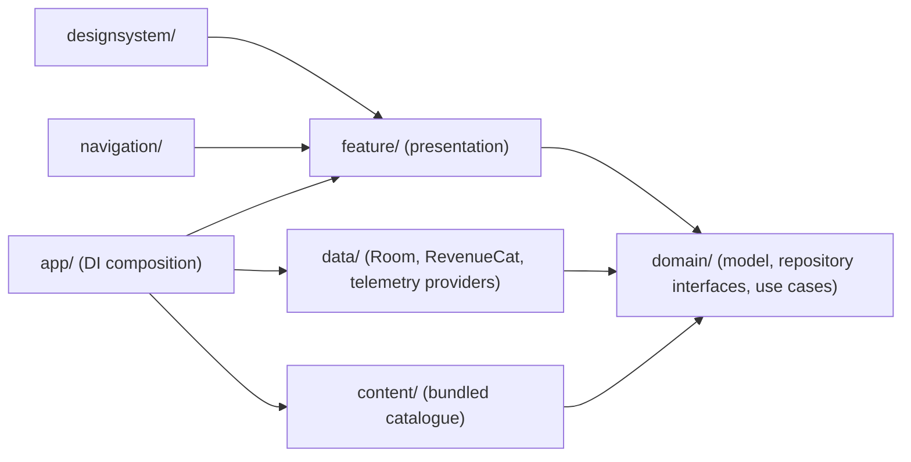

# Architecture

Togetherly is a Kotlin Multiplatform app (Android + iOS) built around a single `shared` module.
This document is a map of that module's layers and the conventions that hold them together. For
the quest-catalogue content system specifically, see [content-system.md](content-system.md). For
the Room-backed local database — tables, transactions, deletion, migration and corruption policy —
see [persistence.md](persistence.md). For the shared theme/component library, see
[design-system.md](design-system.md). For navigation — library choice, the destination model,
Bootstrap's routing logic, and how to add a destination — see [navigation.md](navigation.md). For
completion memory capture (reactions/note/photo/voice), private media storage, and Journey's
derived stars/timeline, see [memory-flow.md](memory-flow.md), [private-media.md](private-media.md),
[journey.md](journey.md), and the Step 10.7 audit in [privacy.md](privacy.md).



`domain` is the only layer every other layer depends on; it never depends back. `content` and
`data` each implement a `domain` repository interface and are only ever resolved through it — see
[Core conventions](#core-conventions) below for the enforcement details.

## Modules

- **`shared`** — everything: domain model, use cases, content pipeline, DI wiring, and the
  Compose Multiplatform UI theme. `commonMain` holds all platform-independent code;
  `androidMain`/`iosMain` hold the small `expect`/`actual` seams (coroutine dispatchers, ID
  generation, Koin's platform module).
- **`androidApp`** — the Android application shell; wires `initKoin()` at startup and hosts the
  Android entry point.
- **`iosApp`** — the Xcode project hosting the iOS entry point, consuming `shared` as a framework.

## Layers (`shared/src/commonMain/kotlin/com/togetherly`)

```
core/          Cross-cutting primitives: DataResult, AppError, AppDispatchers, AppClock,
               IdGenerator, core.ui (UiText + the AppError → UiText mapper every
               presentation layer uses — see below), core.media (platform-neutral
               photo-picker/microphone-permission/app-settings launcher contracts, each
               with an expect/actual Composable resolved only at a feature's Route
               boundary — see memory-flow.md), and core.telemetry (Step 14.1 — provider-neutral
               ProductAnalytics/OperationalDiagnostics contracts, the typed AnalyticsEvent
               vocabulary, the privacy allowlist validator, NoOp/Debug implementations, and
               TelemetryCoordinator — see telemetry.md)
domain/        Pure domain model + repository interfaces + use cases, by feature area
               (family, quest, completion, purchase, daily, saved, journey, localdata — the
               Step 13.7 local-data-deletion coordinator, see local-data-deletion.md — and
               telemetry — the Step 14.1 consent model, see telemetry.md)
content/       The quest-catalogue content boundary: model (DTOs), schema (parsing),
               validation, mapper (DTO → domain), loader, resource, repository
               (the real QuestRepository implementation)
data/          Room-backed implementations of the domain repository interfaces, by feature area
               (family, daily, saved, completion, journey, telemetry) plus data.local (entities,
               DAOs, storage-key mappers, entity↔domain mappers) — see persistence.md — and
               data.media, the app-private photo/voice storage layer (pending/committed
               file lifecycle, image normalization, orphan cleanup) — see private-media.md
designsystem/  The shared theme + component library — see design-system.md
navigation/    Type-safe shared navigation (destinations, Bootstrap, the Main shell) —
               see navigation.md
feature/       Per-feature presentation: model/presentation/validation (+ navigation where a
               feature needs its own internal step-flow logic), by feature area
               (onboarding, today, questdetail, questmode, completion, memory, journey —
               the latter two are completion-memory capture and the Journey stars/timeline,
               see memory-flow.md/journey.md)
app/           Application composition: DI modules, app configuration/info
```

`domain` never imports from `content` or `data`. `content` and `data` each depend on `domain` only
to produce and return domain types — neither leaks its own DTOs, JSON types, or Room
entities/exceptions outward. A `data` repository never exposes its Room implementation type or a
`RoomDatabase` past its own package; every consumer (use cases, Koin resolution) depends only on
the domain interface. See [content-system.md](content-system.md) for the content boundary and
[persistence.md](persistence.md) for the data/persistence boundary, both in detail.

## Core conventions

- **`DataResult<T>`** (`core.result`) — every repository operation returns `Success<T>` or
  `Error(AppError)`. There is no loading state modeled here (that's presentation concern) and no
  silent failure: infrastructure exceptions are always mapped to a typed `AppError`, never thrown
  past a repository boundary. Observable state uses `Flow<DataResult<T>>`; one-shot reads/writes
  use `suspend fun ...(): DataResult<T>`.
- **`AppError`** (`core.error`) — a small sealed hierarchy (`Validation`, `Storage`, `Content`,
  `Purchase`, `Permission`, `Unexpected`), each carrying a typed reason enum plus an optional
  `cause: Throwable?` retained **only** for internal diagnostics/logging. A `cause` must never be
  rendered as user-facing text and must never carry family memory content.
- **Domain value classes** validate their own invariants in an `init` block and throw
  `DomainValidationException` (`domain.validation`) on violation — a small, reused
  `DomainValidationReason` enum, not one reason per exact rule. Most are `internal constructor` +
  `private`-in-spirit but written as `internal` (not `private`) specifically so `commonTest` can
  exercise invariant-rejection paths directly (e.g. `FamilyAccess`, `JourneySummary`).
- **Repositories** are interfaces in `domain.<feature>.repository`; every one has a
  `Fake<Name>Repository` test double in `commonTest`, backed by `MutableStateFlow`, never in
  production source. Production must never resolve a fake repository — see DI below.
- **Use cases** are single-purpose classes with `suspend operator fun invoke(...)`, constructor
  injection only, and no direct access to Koin, the system clock, or random ID generation (those
  come in via `AppClock`/`IdGenerator`).

## Purchase / RevenueCat boundary

`domain.purchase` defines the contract (`EntitlementRepository`, `AccessSnapshot`, `FamilyAccess`,
`PurchasePackage`, `PurchaseResult`/`RestoreResult`, `PurchaseStartupState`) entirely in
vendor-neutral terms — nothing in `domain` or `feature` ever imports a RevenueCat type.
`data.purchase` is the only place `com.revenuecat.purchases.kmp.*` appears:
`RevenueCatConfigurator` is the one call site for `Purchases.configure`, `RevenueCatDataSource`/
`DefaultRevenueCatDataSource` wrap every SDK call, `RevenueCatEntitlementRepository` implements
`EntitlementRepository` against that data source plus a local `EntitlementCache`, and
`RevenueCatMappers` translates SDK offering/customer-info types into `domain.purchase` types. See
[revenuecat-setup.md](revenuecat-setup.md) for API-key management and the Free vs. Family Plus
behavior itself.

## Analytics & diagnostics boundary

`core.telemetry` defines two provider-neutral contracts — `ProductAnalytics` (product events) and
`OperationalDiagnostics` (handled exceptions/breadcrumbs) — plus the typed `AnalyticsEvent`
vocabulary and the privacy-allowlist validator every event passes through before a real provider
ever sees it. `data.telemetry` holds the only PostHog/Sentry-aware code
(`PostHogProductAnalytics`/`SentryOperationalDiagnostics`, each behind a narrow SDK-adapter
interface); a missing project key/DSN falls back to a no-op implementation on every build type, so
neither integration is ever required for the app to run. `TelemetryCoordinator` is the single
place consent (`domain.telemetry`) drives collection on/off. See [telemetry.md](telemetry.md),
[analytics-setup.md](analytics-setup.md), [sentry-setup.md](sentry-setup.md), and
[debug-telemetry.md](debug-telemetry.md) for the full model, provider setup, and debug-only
verification tooling.

## Presentation conventions

- **`UiText`** (`core.ui`) — a string a `ViewModel` can hold without resolving it yet (resolution
  needs a `@Composable` context). `UiText.Resource` wraps a Compose string resource (+ optional
  format args); `UiText.Dynamic` is for the rare case where the text is already fully formed (e.g.
  echoing back user input) — never a way to smuggle an untranslated literal past this type.
- **`AppError.toUiText()`** (`core.ui`, `AppErrorMapper.kt`) — the one mapper from a domain
  `AppError` to a safe `UiText`. Every branch currently resolves to the same generic message
  because `AppError`'s own contract already forbids surfacing its `cause`/reason as user-facing
  text — the `when` stays exhaustive anyway, so a newly added `AppError` variant fails to compile
  here until someone decides what it should say. This is a plain top-level function, not a
  Koin-managed dependency — nothing to resolve, only its own unit test
  (`core.ui.AppErrorMapperTest`) to keep it honest.
- **State/Action/Event** — a feature's `ViewModel` (see `feature.onboarding.presentation` for the
  fullest example) exposes one `@Immutable` `UiState` `StateFlow`, accepts intent through a single
  `fun onAction(action: SomeAction)` (a sealed interface, never a scattered set of public methods),
  and emits one-off effects (a "navigate back" signal, a "created" signal) through a
  `Channel`-backed `Flow`, never through `UiState` itself. `UiState` holds only immutable,
  platform-agnostic data — no `NavController`, `Context`, `SnackbarHostState`, `FocusRequester`,
  keyboard controller, or mutable collection (`kotlinx.collections.immutable`'s `PersistentSet`/
  `PersistentMap`, never a plain `MutableSet`/`MutableMap`).
- **Route vs. Screen** — every feature screen splits into a stateful `XyzRoute` (resolves the
  `ViewModel` via `koinViewModel()`, collects `UiState`/events, and is the *only* place either
  happens) and a stateless `XyzScreen(state, onAction)`. A `ViewModel` is never resolved inside a
  small reusable piece of a screen — only at the route boundary. No `ViewModel` imports any
  `androidx.compose.runtime.Composable` API; no screen calls a repository or a use case directly.
- **Loading/duplicate-action guards** live in the `ViewModel` (e.g. `OnboardingViewModel.onCreateFamily`
  checks `isSaving` before doing anything else), never in the screen — a screen can be tapped
  twice in one frame; the state that decides whether that means anything has to own the guard.

## Dependency injection (Koin)

Modules live in `app.di` and compose in `AppModules.kt`:

```
coreModule          AppDispatchers, AppClock, IdGenerator, AppInfoService
platformModule       expect/actual per target (Android/iOS platform info)
contentModule        the content *pipeline* — JSON config, parser, validator, mappers,
                      resource reader, loader (no QuestRepository binding)
databaseModule       TogetherlyDatabase, its DAOs, and the persistence/domain mappers
repositoryModule     production repository bindings: QuestRepository (content-backed),
                      FamilyRepository/DailyQuestRepository/SavedQuestRepository/
                      CompletionRepository/JourneyRepository/QuestSessionTransaction/
                      DailyQuestTransaction/FamilyDataCleaner (all Room-backed)
readyUseCaseModule   use cases whose complete production dependency graph exists —
                      part of appModules(). Also binds RecommendationConfig,
                      QuestRecommendationPolicy (DeterministicQuestRecommendationPolicy),
                      RecommendationHistoryBuilder and RerollAllowancePolicy
                      (DefaultRerollAllowancePolicy) for GetOrSelectDailyQuest/
                      SelectDailyQuestForContext/RerollDailyQuest, and
                      ReplaceActiveQuestSession alongside StartQuest/CompleteQuest.
                      QuestTimerPolicy/QuestCountdownEngine, LoadQuestMode/AbandonQuest
                      (Step 9.1-9.3) and ResolveCompletionTransition (Step 9.6) live here
                      too — see docs/quest-mode.md. SaveCompletionMemory/
                      DiscardCompletionMemoryDraft (Step 10.3) and JourneyStarPolicy/
                      JourneyConstellationPolicy (Step 10.5) also live here — see
                      docs/memory-flow.md/docs/journey.md
domainUseCaseModule   use cases still missing a production dependency — NOT part of
                      appModules()
presentationModule   ViewModels only (BootstrapViewModel, OnboardingViewModel,
                      TodayViewModel, ...) — resolved via koinViewModel() at each
                      feature's Route boundary, never constructed directly.
                      QuestDetailViewModel/QuestModeViewModel (Step 8.6, QuestModeViewModel
                      rebuilt in Step 9.3), CompletionCelebrationViewModel (Step 9.6), and
                      CompletionMemoryViewModel (Step 10.4) are parameterized factories here
                      (`factory { params -> ... }`), resolved via
                      koinViewModel(key = ...) { parametersOf(id) } — see docs/navigation.md's
                      "Parameterized destinations" section. JourneyViewModel (Step 10.6) is a
                      plain, unparameterized factory, resolved via koinViewModel() at
                      MainShell's Journey tab.
```

`appModules(appConfiguration)` is what `initKoin()` loads in production — `configurationModule,
coreModule, platformModule, contentModule, databaseModule, repositoryModule, readyUseCaseModule,
presentationModule`.
`domainUseCaseModule` is deliberately excluded: the purchase use cases still need
`EntitlementRepository`, which has no real implementation yet. `GetOrSelectDailyQuest`/
`RerollDailyQuest` graduated to `readyUseCaseModule` in Step 8.1, once
`DeterministicQuestRecommendationPolicy` gave them a complete production dependency graph. Loading
`domainUseCaseModule` as part of `appModules()` now would let the graph *look* complete while
failing the moment a purchase use case is resolved. It's loaded explicitly, alongside a fake
`EntitlementRepository`, in `DomainUseCaseModuleGraphTest` (instrumented — see below) to prove it
wires correctly once a real implementation lands.

**Never** add a fake repository to a module used in `appModules()` — that's what
`DomainUseCaseModuleGraphTest`'s own fake-repositories module is for. As each repository gets a
real implementation, it moves out of that test's fakes and its dependent use cases move from
`domainUseCaseModule` into `readyUseCaseModule` (see that module's own KDoc for the current split).

Two Koin-graph tests specifically need a real Android `Context` — resolving any Room-backed
repository does, transitively — and so run under `androidDeviceTest` (instrumented), starting
Koin's actual global context via `startKoin`/`stopKoin` rather than an isolated
`koinApplication { }` instance: `ProductionDatabaseKoinGraphTest` (resolves the real production
graph) and `DomainUseCaseModuleGraphTest` (resolves `domainUseCaseModule` with a fake
`EntitlementRepository`). See `ProductionDatabaseKoinGraphTest`'s own KDoc for exactly why an
isolated Koin instance fails here specifically.

## Application startup

There is no blocking splash screen and no synchronous content load at startup. `initKoin()` only
builds the DI graph — it does not touch the catalogue. `BundledQuestRepository` loads the
catalogue lazily on first access (first `get*`/`observe*` call), off the main dispatcher, so:

- The app can start and use any quest-independent feature immediately.
- A catalogue load failure surfaces as a typed `DataResult.Error(AppError.Content(...))` to
  whatever called it — it never crashes the process, and never blocks unrelated features.
- A failed load doesn't poison future calls: only a successful load is cached, so the next call
  retries the whole pipeline.

## Testing conventions

- Fakes live in `commonTest`, next to the interface they implement, named `Fake<Interface>`.
- Shared behavior across multiple implementations of one interface (e.g. `FakeQuestRepository`
  and `BundledQuestRepository`) is captured once as an abstract contract test
  (`QuestRepositoryContractTest`) with a concrete subclass per implementation, rather than
  duplicating the same assertions — see `domain/quest/repository/QuestRepositoryContractTest.kt`.
- `TestAppClock`, `TestAppDispatchers`, `SequentialIdGenerator` (all in `core.*`, commonTest) are
  the standard test doubles for the cross-cutting `core` abstractions.
- Integration tests that need real content (`integration/*ContentIntegrationTest.kt`) run the real
  content pipeline against a fixture copy of the bundled JSON (see
  [content-system.md](content-system.md)'s pipeline section) combined with fake local repositories
  for whatever domain area doesn't have a production implementation yet.
- Anything that touches a real Room database — including an in-memory one — needs a real Android
  `Context`, unavailable under `:shared:testAndroidHostTest` (no Robolectric configured here). Every
  such test lives in `androidDeviceTest` (instrumented, runs on a device/emulator) instead:
  DAO tests, entity mapper round-trip tests that need the real driver, repository contract tests
  (run against both `Fake*` and `Room*` implementations from the same abstract test class, the
  same pattern as `commonTest`'s contract tests), integration tests using a real file-backed
  database, and the two Koin-graph tests noted above. See [persistence.md](persistence.md) and
  `data/local/RoomDaoTest.kt`'s own KDoc for the confirmed root cause.

## Known environment limitations

- `linkDebugTestIosSimulatorArm64` fails on this toolchain (Xcode 16.3 / SDK 18.4 vs. Compose
  Multiplatform's Skiko cache expecting SDK 18.5) — a pre-existing environment mismatch, not a
  regression, tracked since the project's initial stabilization pass.
- `Res.readBytes` (Compose Resources) cannot run under `:shared:testAndroidHostTest`: the
  generated Android resource reader calls `android.util.Log.d`, which is unmocked outside
  Robolectric (not configured in this project). Any test needing the *real* bundled resource file
  uses a byte-for-byte fixture copy instead — see `content/BundledCatalogueFixture.kt`.
